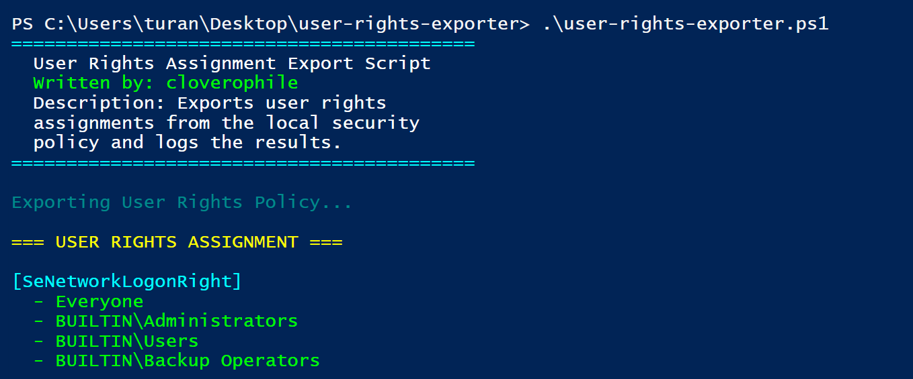

### User Rights Exporter

I've created this PowerShell script **to export user rights assignments from the local security policy** on a Windows machine; to provide a better visibility for enumeration and make the overall process less time-consuming by applying automation. It has been created for educational purposes and contains nothing harmful/malicious for your system. 

---

❗ **Warning #1**: to run the script, you should have administrative privileges. 

❗ **Warning #2**: while running the script, you may be blocked by the PowerShell execution policy, which will prevent you to run this script on your machine. In such a case, you can temporarily disable this policy by changing it for the current PowerShell session (be cautious while completing this action):

```powershell
Set-ExecutionPolicy -Scope Process -ExecutionPolicy Bypass
```

---

To run the script, just clone the repository to your machine, open the folder in a PowerShell terminal and run it:

```text
.\user-rights-exporter.ps1
```

Two files will be created: `exported.cfg` and `UserRightsReport.log`. The second one contains the final result which we want to achieve. Additionally, the script prints the output to the terminal console as well: 


